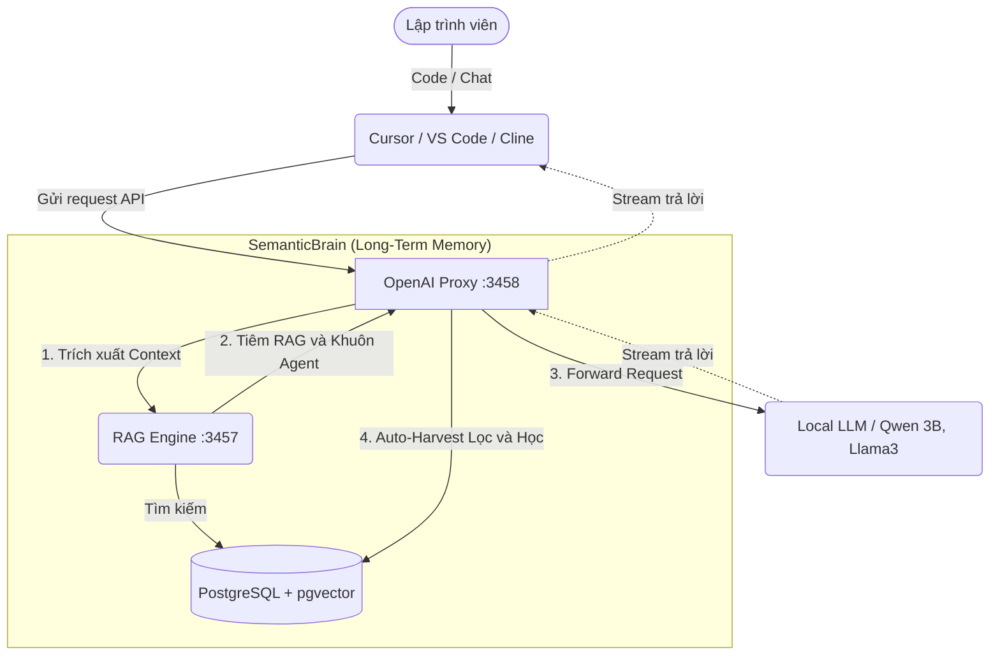

# Semantic Brain

**"The Long-Term Memory Proxy for AI Coding Agents (Cursor, Cline, Ollama)"**

Local RAG knowledge base với Vector Search — chạy hoàn toàn offline, đóng vai trò như một bộ nhớ dài hạn, tự động nhồi kiến thức hệ thống vào Prompt của các AI Agent và IDE mà không cần thay đổi code của Client.

## Kiến trúc (Architecture)



## Stack

| Thành phần | Công nghệ |
|---|---|
| Embedding | `@xenova/transformers` + BGE-M3 (1024d, ~570MB, local) |
| Vector DB | PostgreSQL + pgvector |
| LLM | Ollama (local) → Gemini/Anthropic (cloud fallback) |
| Search | Hybrid RRF (cosine + FTS) |

## Cài đặt Nhanh với Docker (Khuyên dùng)

Đóng gói toàn bộ hệ thống (DB + Core + Proxy) vào một file duy nhất để làm mờ ranh giới Agent. 
Bạn không cần cài Node.js hay Postgres trên máy.

```bash
git clone https://github.com/kzxl/LLMSematicBrain.git
cd LLMSematicBrain

# Chạy toàn bộ hệ thống
docker compose up -d
```

Hệ thống sẽ chạy 2 dịch vụ:
- **Port 3457**: RAG Engine Core (dùng cho các script chủ động).
- **Port 3458**: OpenAI Proxy (Cổng giao tiếp ma thuật cho IDE).

*Lưu ý: Proxy mặc định sẽ kết nối với Ollama chạy ở máy host (qua `host.docker.internal:11434`). Đảm bảo Ollama của bạn đang bật.*

## Cài đặt Thủ công (Manual Setup)

Nếu không dùng Docker:

```bash
npm install
cp .env.example .env
# Chỉnh sửa file .env với thông tin Postgres của bạn

# Chạy server lõi
npm run start

# Mở một terminal khác, chạy Proxy
npm run proxy
```

## OpenAI Proxy (Auto-Harvest & RAG Injector)

`openai-proxy.js` là một máy chủ giả lập chuẩn OpenAI API (`/v1/chat/completions`) bọc quanh Local LLM (VD: Ollama). 
Chỉ cần cấu hình **Base URL** trong Cursor/Cline thành `http://localhost:3458/v1`, nó sẽ mang lại 3 tính năng:

1. **RAG Injection:** Tự động bắt câu hỏi, tra cứu DB và nhúng tri thức vào Prompt.
2. **Auto-Harvest:** Bắt luồng stream trả lời, tự động lọc tạp âm và lưu lại kiến thức kỹ thuật mới vào DB.
3. **Agent Reinforcement:** Tự động tiêm các luật cực kỳ khắt khe (Khuôn Agent) vào System Prompt để chống bệnh nói lảm nhảm của các mô hình size nhỏ (như `qwen2.5:3b`).

## Dùng chung 1 DB cho nhiều project (Multi-tenant)

Hệ thống hỗ trợ `--project=<tên>` để phân biệt không gian kiến thức.

```bash
# ERP Project
node tools/find-qa.js "câu hỏi" --project=erp --tags=ua,inventory
node tools/save-qa.js "Q" "A" --project=erp --tags=inventory

# HelpDesk Project  
node tools/find-qa.js "câu hỏi" --project=helpdesk --tags=backend
node tools/save-qa.js "Q" "A" --project=helpdesk --tags=backend,mongodb
```

## CLI Tools (Chế độ Active Agent)

Ngoài việc chạy ngầm qua Proxy, bạn có thể chủ động tra cứu hoặc lưu trữ qua command line:

```bash
node tools/find-qa-context.js "<task>" [--project=erp] [--tags=ua] [--limit=8]
node tools/find-qa-deep.js "<Q>" [--tags=ua]
node tools/find-skill.js "<intent>"
node tools/post-task.js "<summary>" [--project=erp] --tags=ua,inventory
node tools/stats.js
```
